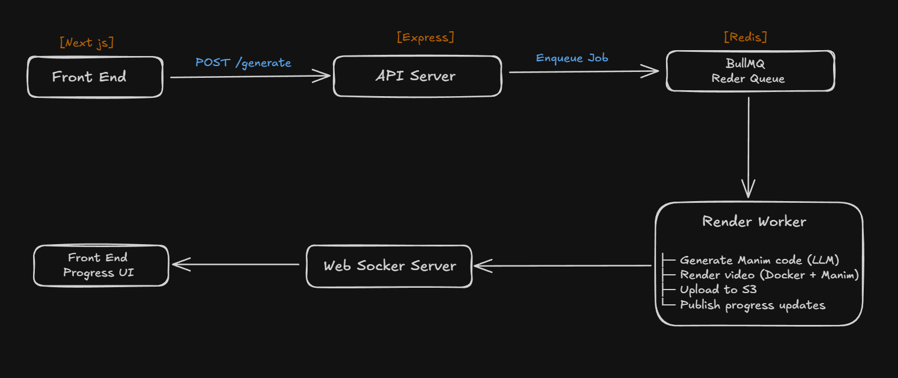

# Manimator – Visualize Math with AI & Manim

Manimator is a full-stack web application that converts natural language math descriptions into animated Manim videos, powered by LLMs, BullMQ, Dockerized Manim, and real-time progress updates via WebSockets.

Users describe a math concept → AI generates Manim code → backend renders it → video is streamed back to the UI with live progress.

---

## Features

- AI-generated Manim code (Google Gemini)
- Automatic video rendering using Dockerized Manim
- Edit & re-render generated code
- Real-time progress updates via WebSockets
- S3 storage with signed URLs + auto cleanup
- Queue-based architecture (BullMQ + Redis)
- Automatic disk & S3 cleanup

---

## Architecture Overview



---

## Frontend (Next.js)

- Framework: Next.js (App Router)
- Styling: TailwindCSS
- State: React hooks
- Transport:
  - REST for job creation & fetching results
  - WebSocket for real-time progress

### Key UI Components

- PromptBar – user input + submit
- ProgressOverlay – live job progress
- CodePanel – editable Manim code
- VideoPanel – rendered video + download
- TopBar / Logo – navigation

---

## Backend (Express + BullMQ)

API Server

- Handles job creation
- Exposes job metadata, code, and video URLs
- Hosts WebSocket server

Worker

- Processes render jobs (1 at a time)
- Generates code via LLM
- Renders video using Dockerized Manim
- Uploads results to S3
- Publishes progress events

---

## Job Lifecycle

queued
↓
processing
├─ generating code
├─ saving code
├─ rendering video
└─ uploading to S3
↓
completed | failed

Each stage updates:

- status
- progress (0–100)
- stage

Updates are published to Redis and pushed to clients via WebSockets.

---

## API Reference

Create Job

POST /api/v1/generate

```bash
{
"prompt": "Visualize Pythagoras theorem"
}
```

Response:

```bash
{
"status": "queued",
"jobId": "uuid"
}
```

---

### Get Job Status

GET /api/v1/job/:jobId

---

### Get Generated Code

GET /api/v1/job/:jobId/code

Returns raw Python code.

---

### Get Video

GET /api/v1/job/:jobId/video

Redirects to signed S3 URL.

---

### Download Video

GET /api/v1/job/:jobId/video/download

---

### Re-render Edited Code

POST /api/v1/job/:jobId/rerender

```bash
{
"code": "<edited manim code>"
}
```

---

### WebSocket API

Endpoint

```bash
ws://<server>?jobId=<jobId>
```

Payload

```bash
{
"status": "processing",
"progress": 60,
"stage": "Rendering video"
}
```

### LLM Details

- Provider: Google Gemini
- Models:
  - gemini-2.5-flash
  - gemini-2.5-flash-lite
- Automatic:
  - retries
  - quota handling
  - fallback between models
- Generated code is validated for:
  - presence of Scene
  - absence of unsafe imports

---

### Docker & Manim

Manim runs inside Docker for isolation and safety:

```bash
manimcommunity/manim:v0.19.1
```

Limits:

- CPU: 2 cores
- Memory: 2 GB
- Network: disabled

---

### Cleanup & Retention

- Local job directories auto-deleted after render
- Janitor removes abandoned folders (>1hr old)
- S3 objects auto-deleted after 24 hours via BullMQ

---

### Environment Variables

Backend

```bash
PORT=5000
NODE_ENV=development
FRONTEND_URL=http://localhost:3000

REDIS_HOST=localhost
REDIS_PORT=6379
REDIS_PASSWORD=

AWS_REGION=us-east-1
AWS_S3_BUCKET=your-bucket
AWS_ACCESS_KEY_ID=xxx
AWS_SECRET_ACCESS_KEY=xxx

GEMINI_API_KEY=your_key
```

Frontend

```bash
NEXT_PUBLIC_API_URL=http://localhost:5000/api/v1
NEXT_PUBLIC_WS_URL=ws://localhost:5000
```

---

### Running Locally

1. Start Redis

```bash
   docker run -p 6379:6379 redis
```

2. Backend API

```bash
   pnpm install
   pnpm run build
   node dist/index.js
```

3. Worker

```bash
   node dist/jobs/worker/renderWorker.js
```

4. Frontend

```bash
   pnpm dev
```

---

### Notes & Limitations

- Only one render per worker (intentional to control resources)
- Signed S3 URLs expire (default: 1 hour)
- Manim code is sandboxed but still validated — do not disable validation

- Designed for educational animations, not heavy 3D scenes

---

### License

MIT
